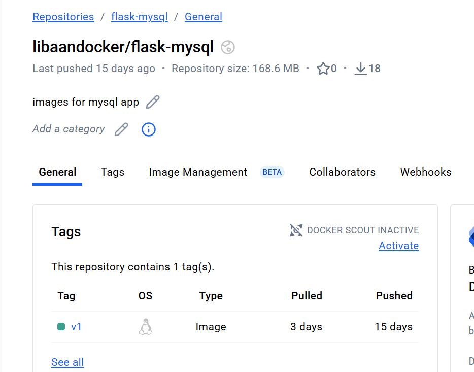
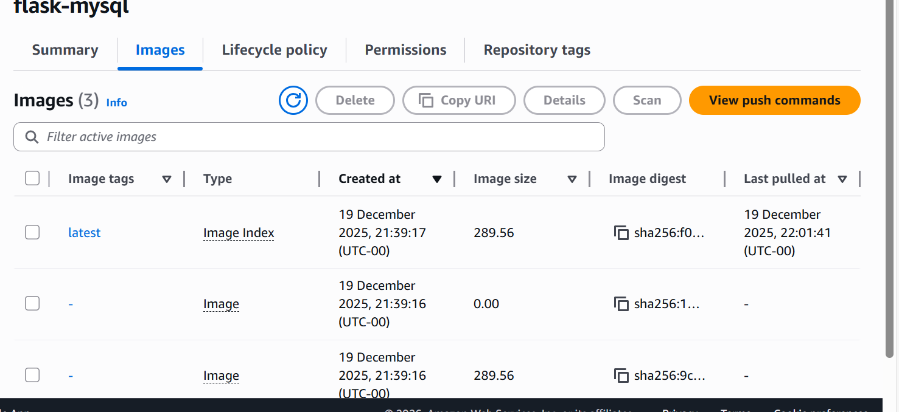

# Docker Learning

**A comprehensive, hands-on introduction to containers, networking, and multi-service systems.**

This repository is intended as a foundational learning resource for anyone seeking to understand Docker through straightforward, practical examples. Rather than learning Docker purely in theory, I have built multiple containerised applications, each illustrating a key Docker concept.
- Single containers
- Containerising applications
- Redis, MySQL, NginX as services
- Docker Compose orchestration
- Scaling containers with load balancing 
- Persistent storage & environment variables
- Pushing & pulling images from public and private repositories (DockerHub & AWS ECR) 

### 1. hello_flask (Flask with MySQL)

#### This project teaches

 Connecting to MySQL database:
 - Install MySQL:   
 ```bash   
sudo apt update
sudo apt install mysql
```
- Connect to it on your application file
```python
import MySQLdb

db = MySQLdb.connect(
    host="mydb",           # Hostname of the MySQL container
    user="root",           # Username to connect to MySQL
    passwd="my-secret-pw", # Password for the MySQL user
    db="mysql"             # Name of the database to connect to
)
```
Multi-stage Dockerfile optimises container deployment by splitting the build into two stages.
The first stage handles building the application, while the second stage creates the final image. This approach reduces the image size, as it does not include all the dependencies needed for building the application.
```dockerfile
 #Stage 1: Build
    FROM python:3.8-slim as Build
    WORKDIR /app
    RUN apt-get update && apt-get install -y \
        gcc \
        python3-dev \
        libmariadb-dev \
        pkg-config
    COPY . .
    RUN pip install flask mysqlclient

    #Stage 2: Producion
    FROM python:3.11 slim
    WORKDIR /app
    COPY --from=Build /app /app
    EXPOSE 5002
    CMD ["python", "app.py"]
```
- Pushing & pulling images from DockerHub (public):
    - Create an account on DockerHub
    - Login to DockerHub through the terminal and enter your details:  
    `docker login`
    - Pushing:
        - Create a repository in DockerHub
        - Build and tag the image in the terminal:  
        `docker build -t <Dockerhub username>/<repository name>:<tag> <dockerfile's directory>` 

            example from project:    
            `docker build -t libaandocker/flask-mysql:v1 .`  
            The "." at the end says the dockerfile is in the current working directory.
        - Push the image:  
        `docker push libaandocker/flask-mysql:v1`  
 </img>
 Pulling:
        - Dockerhub is widely used because of it's accesibility. You can easily pull official, secure, up-to-date images from trusted resources, like MySQL, Mongo, Python, Node.js etc. 
        - Pull by following command:  
        `docker pull <image_name>`  

            example from project:   
            `docker pull mysql`
    - Using the images to run containers:  
    `docker run -d --name <name_container> --network <name_network> -p <port number:port number> <image_name>`  

        example:  
        `docker run -d --name my-app2 --network my-network -p 5002:5002 mysql:latest`
- Pushing & pulling images from AWS ECR (private):
    - Create an AWS account
    - Navigate to the ECR (Elastic Container Registry)
    - Create a repository
    - Pushing:
        - In the terminal, login to AWS and choose your local zone:  
        `aws login`
        - On AWS page, enter your repository and check "View push commands"
        - Follow the steps from AWS, 1-4, copy and paste every command to push the image
        - Refresh the page and the image should pop up
</img>
Pulling:
        - Pull the stored image by using the image's URI
        - In the repository, navigate to Images section and press the highlighted tag
        - Copy the image's URI and head to the terminal
        - Pull the image by following command:  
        `docker pull <image's URI>`
    - Using the images to run containers:  
    `docker run -d --name <name_container> --network <name_network> -p <port number:port number> <image_URI>` 

        example:  
        `docker run -d --name my-app2 --network my-network -p 5002:5002 <image_URI>`
- Creating images for applications of the dockerfile:  
`docker build -t <add image_name> .`  

    example:  
    `docker build -t my-image`
- Creating networks to link multiple containers together:
    - Create a network with following command:  
    `docker network <name>` 

        example:  
        `docker network my-network` 
    - Run the containers linking to the created network:  
    `docker run -d --name <name_container> --network <name_network> -p <port number:port number> <image_name>` 

        example:  
        `docker run -d --name my-app1 --network my-network -p 5002:5002 my-image`  
    And run this for the other container as well.   
    `docker run -d --name my-app2 --network my-network -e MYSQL_ROOT_PASSWORD=my-secret-pw mysql:5.7` 
- Creating docker compose file makes it much easier, you basically run one command and Docker runs all the commands above, creating network to running the containers: 
`docker compose up`  

    ```docker
    services:
        web:
            image: my-flask-app:multistage
            ports:
                - "5002:5002"
            depends_on:
                - mydb

        mydb:
            image: mysql:5.7
            environment:
                MYSQL_ROOT_PASSWORD: my-secret-pw

#
